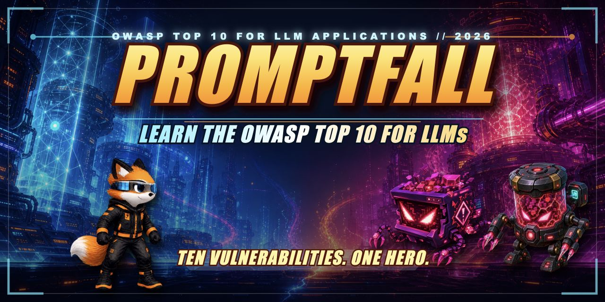

<!--
  Copyright 2026 Exabeam, Inc.
  SPDX-License-Identifier: Apache-2.0
-->

<p align="center">
  
</p>

# Promptfall

**Ten vulnerabilities. One hero. Learn the OWASP Top 10 for LLMs.**

[](https://open-agent-ai-security.github.io/promptfall/)
[](https://github.com/open-agent-ai-security/promptfall/actions/workflows/deploy-pages.yml)
[](LICENSE)
[](https://open-agent-ai-security.github.io/promptfall/)

> ### Catch the 2026 OWASP Top 10 for LLM Applications.

Promptfall is a modern browser platformer that turns the OWASP Top 10 for LLM
Applications 2026 into a playable campaign. Guide Praxi through eleven
high-tech environments, stomp animated threats, and catch concise definitions,
examples, defenses, and key insights without stopping the action.

There is no account, backend, or installation. The entire game runs from static
files and can be played directly on
[GitHub Pages](https://open-agent-ai-security.github.io/promptfall/). The public
site uses cookieless GoatCounter and Cloudflare Web Analytics pageview counters;
it does not record controls, game progress, or educational responses.

---

## The campaign

| Level | Risk |
| ---: | --- |
| 1 | LLM01 — Prompt Injection |
| 2 | LLM02 — Sensitive Information Disclosure |
| 3 | LLM03 — Excessive Agency |
| 4 | LLM04 — Supply Chain |
| 5 | LLM05 — Data and Model Poisoning |
| 6 | LLM06 — Unbounded Consumption |
| 7 | LLM07 — Misinformation |
| 8 | LLM08 — Hidden Context Exposure |
| 9 | LLM09 — Vector and Embedding Weaknesses |
| 10 | LLM10 — Improper Output Handling |
| 11 | **The Gauntlet** — all ten threats, one final run |

Each of the first ten levels contains six educational encounters: a definition,
context for why the risk matters, two examples, and two defenses. The Gauntlet
brings back all ten enemies with one carefully selected key insight per risk.

Defeat every threat to retract the level's force field and reach the exit.
Every third level includes a bonus `+1 integrity` crate. Clear the Gauntlet to
unlock the campaign victory sequence.

---

## Controls

### Desktop

- Move: `A` / `D` or Left / Right Arrow
- Jump: `W`, Up Arrow, or Space
- Sound toggle: `M` or the on-screen sound button
- Direct level select: `F1`–`F11` (`fn` + function key on macOS when required)

### Mobile

- Hold the left or right half of the playfield to run.
- While holding one side, tap with a second finger to jump without losing
  momentum.
- Landscape orientation provides the best mission view.

The game scales to a 16:9 presentation and supports touch-first play without
requiring permanent on-screen direction buttons.

---

## Run locally

Requires Node.js 22.13 or newer.

```bash
npm install
npm run dev
```

Open the local URL shown by the development server.

## Build and test

Build the GitHub Pages-ready static game:

```bash
npm run build:static
```

The result is written to `outputs/promptfall-game` and can be served by any
ordinary static web server.

Run the production application build and rendered-shell tests:

```bash
npm test
```

## Repository

- [`app/Game.tsx`](app/Game.tsx) — campaign data, physics, encounters, and game flow
- [`app/globals.css`](app/globals.css) — title sequence, HUD, announcements, effects, and responsive presentation
- [`public/assets/`](public/assets/) — Praxi sprites, enemies, environments, and community branding
- [`static/`](static/) — static-build entry point
- [`tests/`](tests/) — rendered-shell, metadata, asset, and accessibility checks
- [`NOTICE`](NOTICE) — third-party material, attribution, and licensing scope

---

## Project sponsor

Promptfall is a project of the
[Open Agent and AI Security Community](https://github.com/open-agent-ai-security),
which brings practitioners together to build practical, open-source resources
for securing AI agents and increasingly agentic systems.

The Open Agent and AI Security Community is proudly sponsored by
[Exabeam](https://www.exabeam.com/). Exabeam contributed Promptfall's initial
code and continues to support the Community and its projects as part of its
commitment to security in an increasingly agentic world.

Promptfall also introduces players to
[Praxen](https://open-agent-ai-security.github.io/praxen/), the Community's
free and open-source agent behavior verifier.

---

## Special thanks

Special thanks to the
[OWASP GenAI Security Project](https://genai.owasp.org/) and its worldwide
community of contributors for everything they do to advance open, practical
guidance for securing generative AI. Their work includes developing and
maintaining the OWASP Top 10 for LLM Applications, which provides the
educational foundation for Promptfall.

---

## License

Promptfall source code, original game artwork, and original documentation are
licensed under the [Apache License, Version 2.0](LICENSE).

Educational material in the game is distilled from OWASP Gen AI Security
Project publications, including the OWASP Top 10 for LLM Applications 2026,
and is used under
[Creative Commons Attribution-ShareAlike 4.0 International](https://creativecommons.org/licenses/by-sa/4.0/).
See [NOTICE](NOTICE) for attribution, the location and scope of that material,
and additional third-party asset notices. OWASP names and marks identify the
source material and do not imply endorsement of Promptfall.
